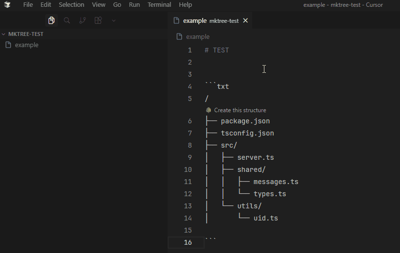

# MkTree 🌳

<p align="center">
  
</p>

**MkTree** is a productivity extension for VS Code and Cursor that instantly transforms text-based tree diagrams (like those in READMEs or documentation) into real files and folders.

---
## 🎬 See it in action / Veja em ação

<p align="center">
  
</p>

---
## 🚀 How to Use / Como Usar

### 🇺🇸 English
1. **Smart Way:** Open any file (like README.md) containing a tree structure. Click the "🌳 Create this structure" link that appears above the diagram.
2. **Manual Way:** Select the tree text, Right-click, and choose "MkTree: Create structure from selection".

### 🇧🇷 Português
1. **Jeito Inteligente:** Abra um arquivo (ex: README.md) com uma estrutura de árvore. Clique no link "🌳 Criar esta estrutura" que aparecerá acima do texto.
2. **Jeito Manual:** Selecione o texto da árvore, Clique com o botão direito e escolha "MkTree: Criar estrutura da seleção".

---

## ✨ Features

- **Smart Detection:** Automatically skips Markdown titles, fences, and irrelevant text.
- **Pre-flight Validation:** Checks for OS-invalid characters and duplicate paths before touching your disk.
- **Known Files Support:** Correcty identifies Dockerfile, package.json, .env, LICENSE, and more as files, even without extensions.
- **Recursive Creation:** Automatically generates all necessary parent directories.
- **Multi-language:** Supports English and Portuguese.

---

## 📝 Example Format

The extension recognizes standard tree outputs like this:

```txt
my-project/
├── src/
│   ├── index.ts
│   └── components/
│       └── Button.tsx
├── .env
└── Dockerfile
```

---

## 🛠 Validation Engine

MkTree includes a "Dry Run" logic. If your structure has errors, it will block the creation process.

---

## ⚙️ Installation

1. Open Cursor or VS Code.
2. Go to Extensions (Ctrl+Shift+X).
3. Click the "..." (top right) > Install from VSIX....
4. Select your mktree-x.x.x.vsix file.

---

<p align="center">
  Developed by [<strong>kayooliveira</strong>](https://github.com/kayooliveira)
</p>